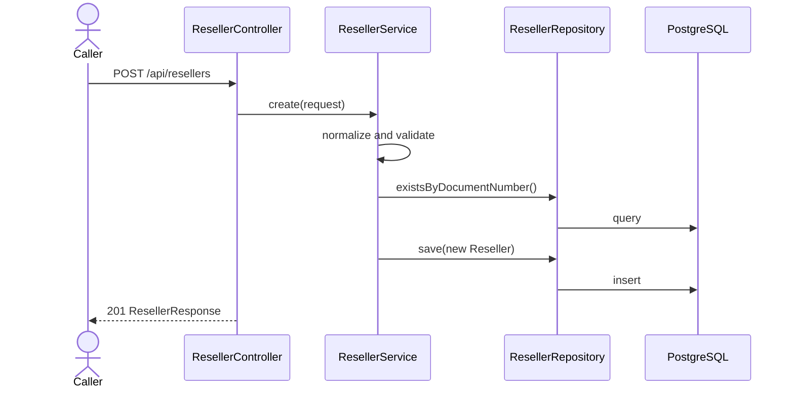
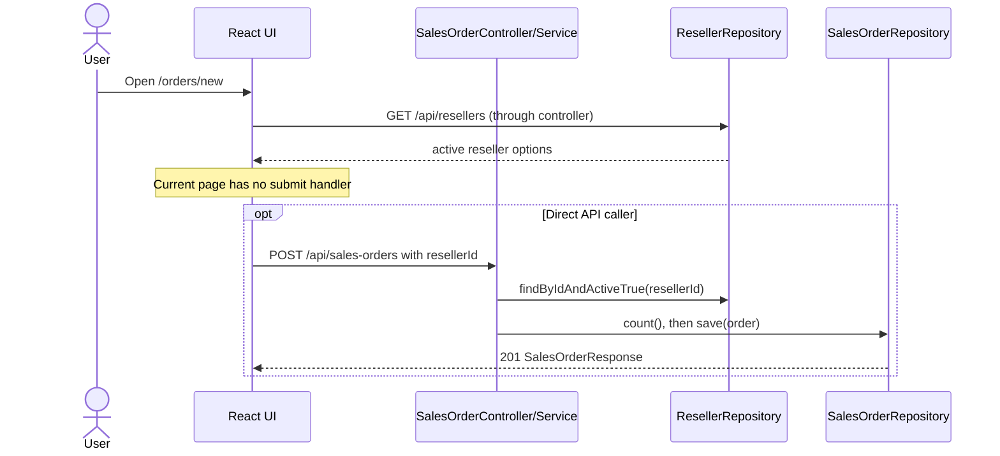
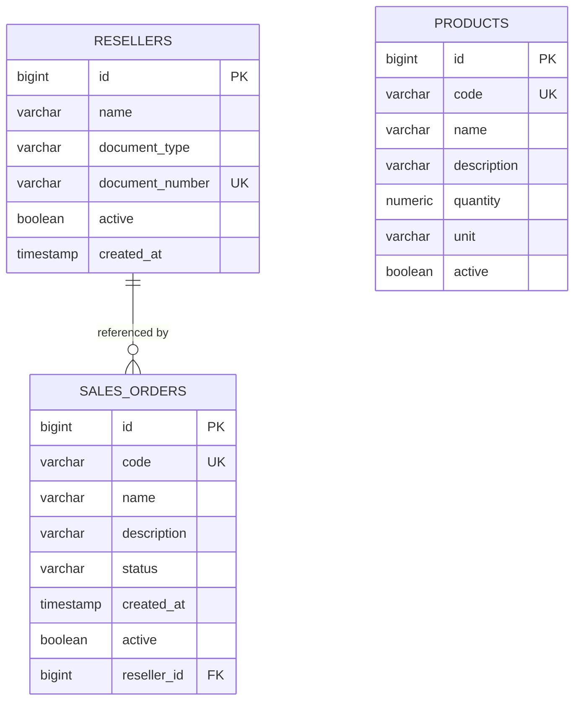

# Venture ERP — Project Context

This document describes the repository as inspected on 2026-07-30. It distinguishes implemented behavior from incomplete or inferred intent. “Needs confirmation” marks facts that cannot be established from the repository.

## 1. Project purpose

### Current implementation

Venture ERP is an early ERP application for managing a factory’s operations. The implemented user-facing MVP is centered on sales orders: a user can list active orders, open create/edit screens, soft-delete orders, view the trash, and restore orders. The backend also supports creating and listing active resellers so that a sales order can reference a reseller. Evidence: `venture-erp-frontend/src/features/home/pages/HomePage.tsx`, `venture-erp-frontend/src/features/sales-orders/`, `venture-erp-backend/src/main/java/br/com/venture/ventureflow/salesorder/`, and `venture-erp-backend/src/main/java/br/com/venture/ventureflow/reseller/`.

The backend contains a partial inventory/product model and service, but it has no HTTP mappings and no frontend feature. It is not part of the usable MVP. Evidence: `venture-erp-backend/src/main/java/br/com/venture/ventureflow/inventory/controller/ProductController.java`.

The main user visible in the code is an internal operator managing sales orders. The application has no authentication, authorization, tenant, role, or user model, so more specific user roles are **Needs confirmation**.

### Planned functionality

- Complete sales-order creation with a selected reseller. The dedicated page loads reseller options but does not submit data (`venture-erp-frontend/src/features/sales-orders/pages/CreateSalesOrderPage.tsx`).
- Complete sales-order editing of the required reseller association. The current edit request omits `resellerId` (`venture-erp-frontend/src/features/sales-orders/pages/EditSalesOrderPage.tsx` and `venture-erp-frontend/src/features/sales-orders/types/salesOrder.ts`).
- Expose product/inventory operations through an API and UI. The existence of entity, DTO, repository, service, empty controller, and no UI suggests work in progress; intended workflows are **Needs confirmation**.
- Reseller management beyond backend create and active-option listing is **Needs confirmation**. Two reseller page files currently exist but are empty.

### Assumptions

- “Customer” in frontend copy appears to correspond to the `Reseller` entity, but the business distinction between customer and reseller is **Needs confirmation**.
- The application is intended for a single organization/factory because no tenant boundary exists. This is an inference, not an enforced rule.

### Pending decisions

- Define the users, roles, authorization boundaries, and whether multi-tenancy is required.
- Confirm whether resellers are the actual buyers/customers on sales orders.
- Confirm the inventory module’s intended scope and its relationship to sales orders.

## 2. Technology stack

| Area | Technology | Repository evidence |
|---|---|---|
| Backend language/runtime | Java 21 | `venture-erp-backend/pom.xml`, `venture-erp-backend/Dockerfile` |
| Backend framework | Spring Boot 4.1.0; Spring Web MVC, Data JPA, Validation | `venture-erp-backend/pom.xml` |
| Persistence | Jakarta Persistence/Hibernate through Spring Data JPA | Entity and repository packages; `application.properties` |
| Database | PostgreSQL JDBC driver; actual server version **Needs confirmation** | `venture-erp-backend/pom.xml`, `application.properties` |
| Frontend | React 19.2.7, React DOM 19.2.7 | `venture-erp-frontend/package.json` |
| Routing | `react-router-dom` declared as 7.18.1; `react-router` also declared as 8.2.0 | `venture-erp-frontend/package.json` |
| Frontend language | TypeScript 6.0.2 | `venture-erp-frontend/package.json` |
| Frontend build | Vite 8.1.1 with `@vitejs/plugin-react` 6.0.3 | `venture-erp-frontend/package.json`, `vite.config.ts` |
| Backend build | Maven wrapper; Maven container 3.9 for Docker builds | `venture-erp-backend/mvnw.cmd`, `Dockerfile` |
| Linting | ESLint 10.6.0 with TypeScript, React Hooks, and React Refresh rules | `venture-erp-frontend/eslint.config.js`, `package.json` |
| Backend deployment artifact | Multi-stage Docker image containing the executable JAR | `venture-erp-backend/Dockerfile` |
| Frontend deployment | Static Vite output is possible, but no hosting/deployment file exists | `package.json`; deployment provider **Needs confirmation** |

The requested Render/Supabase cloud topology is not encoded in a Render blueprint, Supabase config, CI workflow, or existing documentation. Treat it as an intended environment that is **Needs confirmation**, not evidence of a currently deployed system.

## 3. Repository structure

The root contains two independently built applications. Backend code uses the base package `br.com.venture.ventureflow` and mostly groups code by business feature. Frontend code uses feature folders plus a shared application shell.

```text
venture-erp/
├── AGENTS.md
├── docs/
│   └── PROJECT_CONTEXT.md
├── venture-erp-backend/
│   ├── Dockerfile
│   ├── pom.xml
│   └── src/
│       ├── main/
│       │   ├── java/br/com/venture/ventureflow/
│       │   │   ├── config/
│       │   │   ├── inventory/
│       │   │   ├── reseller/
│       │   │   ├── salesorder/
│       │   │   └── shared/exception/
│       │   └── resources/
│       └── test/
└── venture-erp-frontend/
    ├── package.json
    ├── vite.config.ts
    └── src/
        ├── app/layout/
        ├── features/
        │   ├── home/
        │   ├── reseller/
        │   └── sales-orders/
        ├── styles/
        ├── App.tsx
        └── main.tsx
```

Generated folders such as `target`, `dist`, and `node_modules` are intentionally excluded.

## 4. Backend architecture

### Package organization

- `salesorder`: controller plus `model/{dto,entity,repository,service}`.
- `reseller`: controller plus `model/{dto,entity,repository,service}`.
- `inventory`: `controller`, `dto`, `entity`, `exception`, `repository`, and `service`.
- `config`: cross-origin web configuration.
- `shared.exception`: REST exception advice.

This is package-by-feature, although subpackage naming is inconsistent: inventory puts layers directly beneath the feature, while reseller and sales order insert `model`.

### Controllers

`SalesOrderController` and `ResellerController` expose `/api` REST endpoints and delegate to their services. `ProductController` is an empty class without `@RestController`, so no inventory endpoint exists. Controllers use `ResponseEntity`; sales-order request bodies use `@Valid`, while reseller and bulk requests do not. Evidence: each feature’s `controller` package.

### Services

Services construct/update entities, enforce some domain checks, and map to response DTOs. Constructor injection is used throughout. Only `ProductService` methods and `SalesOrderService.softDeleteMany` declare Spring transaction boundaries. The other write methods rely on repository calls rather than explicit service-level transactions. Evidence: service classes under the three feature packages.

### Repositories

All repositories extend `JpaRepository<…, Long>`. Derived queries filter active resellers and orders. Sorting for sales orders is created in the service using `createdAt DESC, id DESC`. There are no custom JPQL/native queries or pagination. Evidence: `SalesOrderRepository.java`, `ResellerRepository.java`, and `ProductRepository.java`.

### Entities and DTOs

JPA entities are mutable classes with generated identity IDs. Public request/response contracts are Java records. Response records provide static `from(entity)` mapping methods. No mapping library is used.

### Validation

- `SalesOrderRequest`: name required/max 150, description max 500, status required, and positive/non-null reseller ID.
- Product create/update DTOs contain Jakarta Bean Validation constraints, but no product controller invokes them.
- `ResellerRequest` has no declarative constraints. `ResellerService` performs manual required/length checks and normalization.
- `SalesOrderBulkRequest.ids` has no Bean Validation and is checked in the service.
- CPF/CNPJ validation checks only digit count after stripping non-digits; it does not validate check digits.

Evidence: DTOs and service classes in each feature.

### Exception handling

`GlobalExceptionHandler` converts `EntityNotFoundException` to HTTP 404 and `MethodArgumentNotValidException` to HTTP 400 with per-field messages. `IllegalArgumentException`, `ProductNotFoundException`, database constraint failures, malformed enums/JSON, and other errors have no application-specific handler. Consequently, service validation such as duplicate/invalid reseller data or an inactive reseller can surface through Spring’s default error handling, commonly as HTTP 500. Evidence: `venture-erp-backend/src/main/java/br/com/venture/ventureflow/shared/exception/GlobalExceptionHandler.java`.

### Configuration and CORS

`application.properties` reads database URL, username, and password from `DB_URL`, `DB_USERNAME`, and `DB_PASSWORD`. `PORT` defaults to `8080`. SQL logging and formatting are enabled. `WebConfig` permits the single origin from `FRONTEND_URL` (default `http://localhost:5173`) for `/api/**`, all headers, and GET/POST/PUT/PATCH/DELETE/OPTIONS methods. Credentials are not explicitly allowed. Evidence: `application.properties` and `config/WebConfig.java`.

### Persistence approach

Hibernate maps entities to PostgreSQL, with `spring.jpa.hibernate.ddl-auto=update`; no migration tool or SQL migration files exist. IDs use database identity generation. Associations are navigated as entities internally and flattened into response DTO fields. Sales-order-to-reseller is lazy, mandatory many-to-one. No cascade is configured.

## 5. Frontend architecture

### Folder organization

- `src/app/layout`: persistent `Sidebar`.
- `src/features/home`: landing page.
- `src/features/sales-orders`: API client, shared form, pages, types, and feature CSS.
- `src/features/reseller`: active-reseller API and type plus two empty page files.
- `src/styles`: reset and global styles.
- `src/App.tsx`: layout and route table.
- `src/main.tsx`: DOM root, strict mode, and browser router.

### Pages and components

- `HomePage`: links to the sales-order list.
- `SalesOrderPage`: loads active orders, renders cards, navigates to new/edit, and soft-deletes individual orders.
- `CreateSalesOrderPage`: loads active reseller options and renders a form, but has no submit handler and no status input.
- `EditSalesOrderPage`: loads an order and submits name, description, and status; it does not display or submit reseller.
- `TrashSalesOrderPage`: lists inactive orders and restores them.
- `SalesOrderForm`: modal form for name/description. `SalesOrderPage` still renders it, but no current UI action calls `openForm`, so it is unreachable.
- `CreatePartRequestPage` and `ResellerPartRequestPage`: empty files.

### API modules and types

`salesOrderApi.ts` wraps `fetch` for create/list/get/update/delete/trash/restore. It does not wrap the backend bulk-delete endpoint. `resellerApi.ts` wraps active reseller listing only; there is no frontend call for reseller creation. Both independently compute the same base URL.

TypeScript interfaces mirror sales-order and reseller-option JSON. There is a contract defect: `UpdateSalesOrderRequest` omits the backend-required `resellerId`, so current edit submissions are rejected by backend validation. Evidence: `src/features/sales-orders/types/salesOrder.ts` and backend `SalesOrderRequest.java`.

### State management

State is local React state (`useState`) with side effects in `useEffect`. There is no global store, server-state/query library, React context, cache, or persistence layer.

### Routing

`BrowserRouter` wraps the app. Routes in `App.tsx` are:

| Browser path | Page |
|---|---|
| `/` | `HomePage` |
| `/orders` | `SalesOrderPage` |
| `/orders/new` | `CreateSalesOrderPage` |
| `/sales-orders/:salesOrderId/edit` | `EditSalesOrderPage` |
| `/sales-orders/trash` | `TrashSalesOrderPage` |
| any other path | redirect to `/` |

Naming alternates between `/orders` and `/sales-orders`. The trash page’s “Back” link targets `/sales-orders`, which is not defined and therefore redirects home.

### Forms

Forms are hand-built controlled or uncontrolled React forms; there is no form library or shared validation schema. The create page is currently nonfunctional, the older modal create logic uses a hardcoded `resellerId: 1`, and the edit form omits the required reseller ID. Browser `required` and manual trimming checks provide only partial client validation.

### Environment variables

`VITE_API_URL` is optional and is declared in `src/vite-env.d.ts`. Both API modules strip one trailing slash and append `/api/...`. If omitted, relative `/api` calls use Vite’s development proxy, whose target is hardcoded to `http://localhost:8080` in `vite.config.ts`. In a static production deployment, an omitted value requires the hosting layer to proxy `/api`; no such production proxy configuration exists.

## 6. Domain model

### SalesOrder

**Purpose.** Represents a sales order (“PV”) owned by one reseller (`salesorder/model/entity/SalesOrder.java`).

**Main fields.**

- `id`: generated `Long` primary key.
- `code`: required, unique, maximum 20 characters; generated as `PV-%02d`.
- `name`: required, maximum 150 characters.
- `description`: nullable, maximum 500 characters.
- `status`: required string enum: `CREATED`, `IN_PROGRESS`, `COMPLETED`, or `CANCELLED`.
- `createdAt`: required timestamp assigned by the service.
- `active`: required boolean; constructor initializes it to true.
- `reseller`: required lazy many-to-one association.

**Relationships.** Many sales orders can reference one reseller through non-null `reseller_id`. There is no reverse collection on `Reseller`, cascade, or orphan behavior.

**Lifecycle and status rules.** Creation accepts any declared status supplied by the client; it is not forced to `CREATED`. Updates can move directly between any enum values. No transition matrix, terminal-state rule, or timestamp update exists. Soft deletion and activation only toggle `active`; they do not alter status. More detailed lifecycle rules are **Needs confirmation**.

**Soft delete.** Active list and trash list filter `active=true` and `active=false` respectively. Direct lookup/update uses `findById` without an active filter, so soft-deleted orders can still be fetched or updated by ID. Restore is allowed regardless of current state.

**Important invariants.** The database requires unique code and a reseller. The service accepts only an active reseller during create/update. Code generation is `repository.count() + 1`, which is neither concurrency-safe nor safe after physical deletion; the unique constraint may reject duplicates.

### Reseller

**Purpose.** Represents the party associated with a sales order and provides selectable active options (`reseller/model/entity/Reseller.java`).

**Main fields.**

- `id`: generated `Long` primary key.
- `name`: required, maximum 150 characters; trimmed by the service.
- `documentType`: required enum `CPF` or `CNPJ`, stored as a string up to 4 characters.
- `documentNumber`: required, maximum 14 characters, globally unique.
- `active`: required, defaults true.
- `createdAt`: required, immutable through JPA updates, assigned by the service.

**Relationships.** `SalesOrder` owns the many-to-one relationship. No reseller-side collection is modeled.

**Lifecycle and status rules.** The only exposed reseller operations are create and list active options. The entity has `setActive`, but no service/controller endpoint activates, deactivates, updates, retrieves, or deletes a reseller.

**Soft delete.** An `active` flag and active-only queries exist, but no current API changes that flag. Whether reseller soft-delete is planned is **Needs confirmation**.

**Important invariants.** Document input is normalized to digits and must have 11 digits for CPF or 14 for CNPJ. Check digits are not verified. Uniqueness is checked in the service and enforced by the database. Name and document checks are manual because `ResellerRequest` has no validation annotations.

### Product

**Purpose.** Partial inventory record for a quantity of a uniquely coded product (`inventory/entity/Product.java`).

**Main fields.**

- `id`: generated `Long` primary key.
- `code`: required, unique, maximum 50 characters.
- `name`: required, maximum 150 characters.
- `description`: nullable, maximum 500 characters.
- `quantity`: required decimal `(12,3)`.
- `unit`: required enum `UNIT`, `METER`, `SHEET`, `SQUARE_METER`, or `BOX`, stored as a string up to 30 characters.
- `active`: required and initialized true.

**Relationships.** None. Products are not connected to sales orders, order lines, resellers, or stock movements.

**Lifecycle and status rules.** The service supports create, list, get, metadata update (not quantity), deactivate, and activate. Quantity is set only on creation at present. Because no controller exists, none of these operations is reachable over HTTP.

**Soft delete.** `activate`/`deactivate` toggle `active`, but `findAll` and `findById` do not filter inactive records. This is an activity flag, not a complete soft-delete implementation.

**Important invariants.** DTO validation requires nonblank code/name, nonnegative quantity on create, and a unit. The database enforces code uniqueness and nullability. There is no stock ledger, atomic adjustment operation, or rule tying quantity to business events.

## 7. API contract

“Implemented” means a mapped backend endpoint exists; it does not imply that a complete frontend flow calls it.

| Method | Path | Controller | Request type | Response type | Purpose | Current status |
|---|---|---|---|---|---|---|
| POST | `/api/resellers` | `ResellerController` | `ResellerRequest` | `ResellerResponse` (201) | Create a reseller | Implemented; no `@Valid`; no frontend client |
| GET | `/api/resellers` | `ResellerController` | None | `List<ResellerOptionResponse>` (200) | List active resellers by name | Implemented and used by create-order page |
| POST | `/api/sales-orders` | `SalesOrderController` | `SalesOrderRequest` | `SalesOrderResponse` (201) | Create an active order with generated code | Implemented; dedicated frontend form does not submit |
| GET | `/api/sales-orders` | `SalesOrderController` | None | `List<SalesOrderResponse>` (200) | List active orders newest first | Implemented and used |
| GET | `/api/sales-orders/{id}` | `SalesOrderController` | Path `Long id` | `SalesOrderResponse` (200) | Get an order, active or inactive | Implemented and used by edit page |
| PUT | `/api/sales-orders/{id}` | `SalesOrderController` | `SalesOrderRequest` | `SalesOrderResponse` (200) | Replace editable order fields and reseller | Implemented; frontend omits required `resellerId` |
| DELETE | `/api/sales-orders/{id}` | `SalesOrderController` | Path `Long id` | Empty (204) | Set `active=false` | Implemented and used |
| PATCH | `/api/sales-orders/{id}/activate` | `SalesOrderController` | Path `Long id` | Empty (204) | Set `active=true` | Implemented and used |
| PATCH | `/api/sales-orders/bulk-soft-delete` | `SalesOrderController` | `SalesOrderBulkRequest` | Empty (204) | Soft-delete a set of IDs atomically | Implemented; no frontend client; body validation is manual |
| GET | `/api/sales-orders/trash` | `SalesOrderController` | None | `List<SalesOrderResponse>` (200) | List inactive orders newest first | Implemented and used |

There are no product endpoints despite the product service, and there are no endpoints for reseller get/update/deactivate/restore.

## 8. Main application flows

### Creating a reseller

No frontend flow exists. An API caller posts a name, document type, and document number. The service trims the name, strips non-digits, verifies only expected digit count, checks repository uniqueness, sets `createdAt` and `active=true`, saves, and returns the full reseller DTO.



### Creating and associating a sales order

The backend validates the request DTO, looks up the reseller with `findByIdAndActiveTrue`, generates a count-based code, constructs an active order, and saves it. The required association is established at construction. The dedicated frontend page currently stops after rendering reseller options; the older modal path is unreachable and contains `resellerId: 1`.



### Updating an order

The backend loads by ID, requires an active reseller, then updates name, description, status, and reseller; code, creation timestamp, and active flag stay unchanged. The current UI loads an order and edits only name, description, and status, so its PUT body lacks `resellerId` and fails validation.

### Soft-deleting and restoring an order

The list UI confirms deletion, calls DELETE, and removes the order from local state. The backend toggles `active=false`. The trash page fetches inactive orders and PATCHes `/activate`; on success it removes the restored order from local trash state. No physical delete endpoint exists. Bulk soft-delete exists only in the backend.

## 9. Database model

The schema below is inferred from JPA annotations. With `ddl-auto=update`, the actual deployed schema can drift and is **Needs confirmation**.

| Table | Important columns and constraints |
|---|---|
| `resellers` | `id` identity PK; `name varchar(150) NOT NULL`; `document_type varchar(4) NOT NULL`; `document_number varchar(14) NOT NULL`; `active NOT NULL`; `created_at NOT NULL`; unique constraint `uk_resellers_document_number(document_number)` |
| `sales_orders` | `id` identity PK; `code varchar(20) NOT NULL UNIQUE`; `name varchar(150) NOT NULL`; `description varchar(500) NULL`; `status varchar(30) NOT NULL`; `created_at NOT NULL`; `active NOT NULL`; `reseller_id NOT NULL` FK to `resellers.id` inferred from `@ManyToOne` |
| `products` | `id` identity PK; `code varchar(50) NOT NULL UNIQUE`; `name varchar(150) NOT NULL`; `description varchar(500) NULL`; `quantity numeric(12,3) NOT NULL`; `unit varchar(30) NOT NULL`; `active NOT NULL` |



`ddl-auto=update` mutates schema at startup without a reviewed, versioned migration history. It cannot reliably express all production migrations or data transformations, may produce environment drift, makes rollback difficult, and couples application startup permissions to schema modification. No Flyway/Liquibase dependency or migration directory exists.

## 10. Local and cloud environments

### Local: frontend → backend → PostgreSQL

1. A local PostgreSQL database must already exist; its version and provisioning steps are **Needs confirmation**.
2. The backend uses `DB_URL`, `DB_USERNAME`, and `DB_PASSWORD` and listens on `PORT` or `8080`.
3. The frontend dev server runs on Vite’s default port (normally 5173). With `VITE_API_URL` omitted, `/api` is proxied to `http://localhost:8080`.
4. Backend CORS defaults `FRONTEND_URL` to `http://localhost:5173`.

Required variable names:

| Component | Variable | Required | Purpose |
|---|---|---:|---|
| Backend | `DB_URL` | Yes | JDBC PostgreSQL URL |
| Backend | `DB_USERNAME` | Yes | Database username |
| Backend | `DB_PASSWORD` | Yes | Database password |
| Backend | `PORT` | No | HTTP port; defaults to 8080 |
| Backend | `FRONTEND_URL` | No locally | Single allowed CORS origin; defaults to local Vite |
| Frontend | `VITE_API_URL` | No locally | Absolute backend base URL; relative proxy is used when absent |

No secret values should be committed or added to documentation. The repository ignores `.env` variants and secret/local property files.

### Intended cloud: Render frontend → Render backend → Supabase PostgreSQL

This topology was specified for documentation, but repository evidence is incomplete:

- The backend Dockerfile is suitable for a container service and exposes port 10000, while Spring reads the provider-supplied `PORT`.
- A static frontend build is available via `npm run build`.
- Generic PostgreSQL configuration can point to a Supabase PostgreSQL database.
- `VITE_API_URL` can point the static frontend at the backend, and `FRONTEND_URL` can allow the frontend origin.
- There is no `render.yaml`, frontend rewrite configuration, Supabase project config, CI/CD workflow, or provider-specific documentation. Actual Render services, Supabase connection mode/SSL requirements, regions, custom domains, health checks, build commands, and deployed status are **Needs confirmation**.

For this intended topology, configure only the same variable names listed above in provider secret/environment settings. Do not place credentials in repository files or expose backend secrets through `VITE_` variables.

## 11. Architectural decisions already visible

| Decision | Evidence | Benefits | Current limitations |
|---|---|---|---|
| Package by feature | Backend `salesorder`, `reseller`, `inventory`; frontend `features/*` | Keeps related business code together | Backend layer subpackages differ between inventory and other features |
| DTOs separate from entities | Request/response records and `Response.from` mappers | Avoids directly serializing JPA entities and controls contracts | Manual mapping; create/update often share one request contract |
| Required reseller association | `SalesOrder.reseller`, non-null join, `SalesOrderRequest.resellerId` | Prevents orphan orders at API/database layers | UI creation/editing does not yet satisfy the contract; business meaning needs confirmation |
| Soft deletion for sales orders | `active`, active/trash queries, delete/activate endpoints | Allows recovery and separates normal/trash lists | Direct lookup/update includes inactive orders; no deletion metadata or audit |
| API URL through environment | `VITE_API_URL` in both API modules | Supports different backend origins | Logic is duplicated; production fallback/rewrite is unspecified |
| Environment-driven backend config | `${DB_*}`, `${PORT}`, `${FRONTEND_URL}` | Keeps secrets and deployment-specific values out of source | No profiles, startup validation guidance, or checked-in safe environment template matching all variables |
| Render/Supabase deployment intent | Generic Docker/static/PostgreSQL compatibility only | Managed hosting/database can reduce operations work | Provider choice and actual deployment are **Needs confirmation**; no provider files exist |
| Hibernate-managed schema updates | `ddl-auto=update` | Low setup friction during early development | No reproducible migrations, review, rollback, or reliable environment parity |
| Local component state | React hooks in pages | Simple for a small MVP | Repeated loading/error patterns and no shared server cache |

## 12. Technical debt and risks

- **Count-based sales-order codes:** `SalesOrderService.generateNextCode()` uses total row count plus one. Concurrent creates can generate the same code; physical deletion/imports can reuse codes; formatting exceeds two digits naturally but the intended code format is **Needs confirmation**.
- **No migration system:** `ddl-auto=update` is enabled and there are no versioned migrations.
- **Minimal automated tests:** only `contextLoads()` exists. There are no service, controller, repository, frontend, or end-to-end tests.
- **Validation gaps:** reseller DTO and bulk request lack Bean Validation; product validations are unreachable through HTTP; CPF/CNPJ checks only length; sales-order status transitions are unrestricted.
- **Incorrect error classification:** `IllegalArgumentException` and `ProductNotFoundException` are not handled. Business/input failures can become HTTP 500 instead of 4xx.
- **Frontend/backend update mismatch:** update requests omit required `resellerId`, making the edit flow fail validation.
- **Incomplete create flow:** `/orders/new` has no submit handler; dormant modal logic hardcodes reseller ID 1.
- **Repeated API base URL setup:** reseller and sales-order API modules duplicate `VITE_API_URL` normalization.
- **Route inconsistency:** `/orders` and `/sales-orders` are mixed; trash “Back” targets an undefined route.
- **Incomplete inventory boundary:** product service exists with an empty controller and no UI. `activate` returns an entity whereas other service operations return DTOs.
- **Transaction inconsistency:** several multi-step create/update methods have no explicit service transaction; code generation and insert are not atomic as a unit.
- **No pagination:** list endpoints load all matching rows.
- **No authentication/authorization:** every endpoint is public at the application layer.
- **No auditability:** there is no updated/deleted timestamp, actor, optimistic version, or audit log.
- **Potential SQL/log exposure:** SQL logging is enabled for all configured environments.
- **Dependency inconsistency:** `react-router` 8.2.0 and `react-router-dom` 7.18.1 are declared at different major versions. Compatibility and necessity of the direct `react-router` dependency need review.
- **Cloud deployment unspecified:** no Render, Supabase, health-check, frontend SPA rewrite, or CI/CD configuration exists.

## 13. Pending architecture decisions

- Define authentication, authorization, user roles, and tenant model.
- Decide whether `Reseller` is the customer model or a distinct business party.
- Define sales-order status transition rules, cancellation semantics, and whether inactive orders may be read/edited.
- Replace or formally define sales-order code allocation, including concurrency, gaps, and format.
- Select a migration tool and establish schema ownership/deployment workflow.
- Decide inventory scope: catalog vs. stock ledger, quantity adjustment rules, movements, reservations, and sales-order line relationships.
- Define reseller lifecycle and referential behavior when a reseller is deactivated.
- Establish API error format and map all validation/conflict/not-found cases consistently.
- Decide whether PUT uses a complete replacement contract or whether separate create/update DTOs and PATCH semantics are preferable.
- Decide pagination, filtering, search, and sorting contracts.
- Establish time-zone policy and whether API timestamps must include an offset/UTC.
- Confirm Render/Supabase as the deployment target and specify health checks, SSL/database connection mode, SPA rewrites, environments, backups, and secret rotation.
- Select frontend server-state/form approaches if feature count grows.
- Define observability, audit, backup/recovery, and operational security requirements.

## 14. Recommended next steps

### Critical

1. Fix the sales-order create/edit UI contracts: submit the selected active reseller and include `resellerId` on updates; remove the hardcoded ID path.
2. Replace count-based order code generation with a database-safe strategy and add concurrency coverage.
3. Introduce versioned database migrations and stop using `ddl-auto=update` outside disposable development databases.
4. Define consistent 4xx error handling for validation, illegal business input, missing products/orders, and unique conflicts.
5. Confirm and implement authentication/authorization before exposing the service beyond a trusted development environment.

### Important

1. Add backend service/controller integration tests and frontend flow tests for create, edit, soft-delete, trash, and restore.
2. Finish or explicitly defer the inventory module; do not expose its service until its domain rules are defined.
3. Normalize browser routes and fix the trash back link.
4. Add declarative reseller/bulk validation and validate CPF/CNPJ according to confirmed business requirements.
5. Add pagination and explicit sorting/filter contracts before data volume grows.
6. Make transaction boundaries consistent and consider optimistic locking for concurrent updates.
7. Add checked-in deployment configuration/documentation after Render/Supabase decisions are confirmed, including SPA fallback and health checks.

### Later

1. Centralize frontend API configuration and shared response/error parsing.
2. Add update/deletion metadata and audit history if required.
3. Review UI language consistency, accessibility, loading states, and apparent character-encoding issues.
4. Remove template/readme remnants and reconcile router dependencies.
5. Add production logging/observability and disable verbose SQL logging by environment.

## 15. Files an architect should inspect first

| File | Why it matters |
|---|---|
| `venture-erp-backend/pom.xml` | Authoritative backend runtime, framework, dependency, and Java versions |
| `venture-erp-backend/src/main/resources/application.properties` | Database, schema update, logging, server, and CORS environment contract |
| `venture-erp-backend/src/main/java/br/com/venture/ventureflow/salesorder/model/entity/SalesOrder.java` | Central MVP aggregate data and required reseller relationship |
| `venture-erp-backend/src/main/java/br/com/venture/ventureflow/salesorder/model/service/SalesOrderService.java` | Order lifecycle, code generation, association checks, sorting, soft delete, and bulk behavior |
| `venture-erp-backend/src/main/java/br/com/venture/ventureflow/salesorder/controller/SalesOrderController.java` | Complete mapped sales-order API surface |
| `venture-erp-backend/src/main/java/br/com/venture/ventureflow/reseller/model/entity/Reseller.java` | Reseller constraints and persisted lifecycle fields |
| `venture-erp-backend/src/main/java/br/com/venture/ventureflow/reseller/model/service/ResellerService.java` | Name/document normalization, validation, uniqueness, and active options |
| `venture-erp-backend/src/main/java/br/com/venture/ventureflow/shared/exception/GlobalExceptionHandler.java` | Current public error behavior and missing mappings |
| `venture-erp-backend/src/main/java/br/com/venture/ventureflow/inventory/entity/Product.java` | Existing but incomplete inventory domain boundary |
| `venture-erp-backend/Dockerfile` | Backend container build/runtime assumptions |
| `venture-erp-frontend/package.json` | Frontend versions, scripts, and absence of a test script |
| `venture-erp-frontend/src/App.tsx` | Browser route and application-shell definition |
| `venture-erp-frontend/src/features/sales-orders/api/salesOrderApi.ts` | Frontend’s implemented backend calls and URL strategy |
| `venture-erp-frontend/src/features/sales-orders/types/salesOrder.ts` | Client-side API contract, including the update mismatch |
| `venture-erp-frontend/src/features/sales-orders/pages/SalesOrderPage.tsx` | Main operator workflow and dormant hardcoded create path |
| `venture-erp-frontend/src/features/sales-orders/pages/CreateSalesOrderPage.tsx` | In-progress reseller selection and missing submission |
| `venture-erp-frontend/src/features/sales-orders/pages/EditSalesOrderPage.tsx` | Current edit behavior and missing reseller field |
| `venture-erp-frontend/vite.config.ts` | Local API proxy behavior |

## Determination gaps

The repository does not determine the organization’s precise business processes, user roles, authentication model, production database version/schema state, sales-order numbering policy, reseller/customer semantics, inventory rules, real deployment status, Render/Supabase service configuration, CI/CD process, operational requirements, or production environment values. Each requires confirmation outside the codebase.
